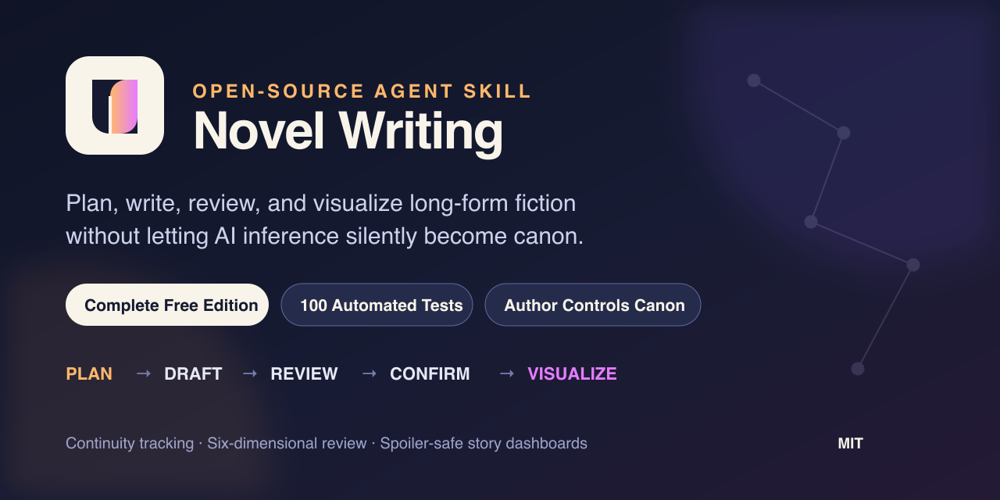

# Novel Writing

> An author-controlled Agent Skill for planning, drafting, reviewing, revising, auditing, and visualizing complete long-form fiction projects.



[Chinese README](README_CN.md) · [Changelog](CHANGELOG.md) · [Contributing](CONTRIBUTING.md) · [Security](SECURITY.md)

## What problem does it solve?

Many fiction tools are good at generating a passage immediately. The harder problem in a long novel is preserving coherence at chapter 20, 50, or 100: characters must still behave like themselves, secrets must not leak early, injuries and objects must persist, relationships and clues must evolve consistently, and AI suggestions must not silently become canon.

Novel Writing treats fiction as an author-controlled project rather than a one-shot prose prompt. It supports:

- The full path from premise, story structure, and character arcs to reviewed chapters and a completed manuscript.
- A three-state model—`confirmed`, `inferred`, and `author-planned`—that keeps canon separate from interpretation and future plans.
- Continuity checks across chronology, location, physical state, inventory, knowledge boundaries, relationships, and unresolved promises.
- Manual review, AI review with human curation, and AI review-and-revision with human curation.
- Timeline, relationship, mystery, and clue visualizations in author and spoiler-safe reader modes.
- Project-local storage for manuscript, worldbuilding, research, and structured story state.

## Why this workflow is reliable

```text
Premise and creative boundaries
    ↓
Master outline and character arcs
    ↓
Author selects the next chapter boundary
    ↓
Load relevant context, previous chapter, and continuity records
    ↓
Draft chapter → six-dimensional review → author-curated revision
    ↓
Preview candidate state → author confirmation → safe merge
    ↓
Timeline / relationship / clue visualization
    ↓
Continue chapter by chapter until the manuscript is complete
```

The order provides four important safeguards:

1. **Resolve intent before generating prose.** Questions stay anchored to material the author has already provided, reducing generic interrogation and unauthorized invention.
2. **Draft before changing canon.** New chapter information is presented as candidate state and becomes structured canon only after explicit author confirmation.
3. **Report contradictions before repairing them.** The AI cannot silently rewrite author decisions merely to make validation pass.
4. **Review before visualizing.** Dashboards are generated from reviewed, confirmed state rather than discarded prose or speculation.

## Core advantages

### The author controls canon

Every story-state item uses one of three certainty levels:

- `confirmed`: canon explicitly accepted by the author.
- `inferred`: a conclusion supported by the manuscript but not yet confirmed.
- `author-planned`: a future event, reveal, or secret the author intends to use.

This prevents suggestions, guesses, and unrevealed plans from silently entering canon.

### Continuity is more than a timeline

Continuity auditing covers:

- Event order, elapsed time, travel, and recovery time.
- Location, injuries, fatigue, clothing, abilities, and environmental effects.
- Item ownership, transfer, consumption, damage, and access.
- What the author, reader, narrator, and each character separately know.
- Trust, obligation, conflict, intimacy, and relationship change.
- Foreshadowing, mysteries, promises, threats, and expected payoffs.

A hard knowledge-boundary rule applies: a character cannot answer from information they have never seen, heard, or otherwise learned.

### Complete six-dimensional chapter review

After completing a chapter, choose one of three modes:

1. `manual review only`
2. `auto review with human curation`
3. `auto review and auto-revise with human curation`

Automated review covers worldbuilding and continuity, pacing and development, clue subtlety, theme and focus, dialogue individuality, and narrative clarity. The author still decides which changes to accept.

### Author and spoiler-safe reader visualizations

Offline HTML dashboards support:

- Story chronology and causal relationships.
- Characters, factions, and changing relationships.
- Mysteries, clues, holders, red herrings, and payoff networks.
- Author mode with plans, hidden relationships, and unrevealed payoffs.
- Reader mode with author-only and spoiler information removed and internal identifiers re-anonymized.

### Safe, verifiable state updates

Chapter state follows a deterministic sequence: candidate extraction → complete preview → digest verification → author confirmation → atomic write → post-write validation. Failed updates cannot partially modify canonical state or silently overwrite an existing dashboard.

The repository includes 100 automated tests covering the data model, reference integrity, reader redaction, atomic publishing, path and symlink safety, CLI behavior, and the end-to-end workflow. These tests verify engineering behavior; they do not claim to measure literary quality.

## How it differs from common approaches

The following anonymized comparison summarizes differences observed across open-source fiction-writing tools without naming individual projects:

| Dimension | Novel Writing | Lightweight prompt tools | Large modular suites | RAG / graph systems |
| --- | --- | --- | --- | --- |
| Premise to manuscript | One complete workflow | Usually focused on generation or rewriting | Often complete, with a higher learning cost | Often complete, with a heavier workflow |
| Canon authority | Three-state model with author-confirmed merges | Usually relies on chat context | Depends on the module | Stateful, but author authority may be unclear |
| Continuity | Time, place, items, knowledge, relationships, and clues | Mostly prompt-based checks | Broad coverage with fragmented implementation | Strong retrieval with complex state governance |
| Data safety | Validation, digest binding, atomic publishing, and safe paths | Usually no deterministic write layer | Depends on the module | Often emphasizes retrieval over confirmed writes |
| Review | Six dimensions with human choice preserved | Usually one-pass polishing | Rich review modules | Often requires an additional pipeline |
| Visualization | Author and spoiler-safe reader views | Usually absent | May depend on a separate workbench | Often includes graphs without reader redaction |
| Maintainability | Standard-library runtime and 100 automated tests | Simple and quick to start | More files and dependencies | Strong engineering with heavier deployment |

The goal is not to write the fastest possible first draft. It is to help authors forget less, preserve authority, and avoid story-state pollution throughout a long project.

## Installation

Python 3.9 or later is required. Runtime scripts use only the Python standard library.

### Codex

```bash
git clone https://github.com/guantoubaozi/novel-writing.git
cp -R novel-writing ~/.codex/skills/novel-writing
```

Start a new session with:

```text
Use $novel-writing to create a new novel project.
```

You can also place the repository in the skill directory of any agent that supports the `SKILL.md` standard.

## Three-minute quick start

### 1. Initialize a project

```bash
python3 scripts/init_project.py ~/Documents/my-novel \
  --title "Letters from Mist Harbor" \
  --language en
```

### 2. Develop the story

```text
Use $novel-writing with the project at ~/Documents/my-novel.
Help me establish the central conflict, character motivations, creative boundaries, and master outline.
```

### 3. Draft the next chapter

```text
/novel:chapter
Project: ~/Documents/my-novel
Draft chapter one from the chapter plan. Load the relevant world, character, previous-chapter, and continuity context first.
```

### 4. Review and visualize

```text
/novel:review
Run auto review with human curation on the completed chapter.
```

```text
/novel:visualize
Preview the timeline, relationship, and clue changes from this chapter. After confirmation, generate the author dashboard.
```

## Supported operations

| Operation | Purpose |
| --- | --- |
| `/novel:new` | Initialize a project and establish its premise |
| `/novel:outline` | Create or revise the master outline and chapter plan |
| `/novel:chapter` | Draft the next author-selected chapter |
| `/novel:review` | Run the six-dimensional chapter review |
| `/novel:revise` | Revise from structure down to sentence level |
| `/novel:audit` | Validate structured continuity and report conflicts |
| `/novel:visualize` | Update and render story visualizations |
| `/novel:status` | Report chapter, word-count, mystery, clue, and relationship status |

## Free edition boundary

The free edition places no limits on novel length, chapter count, character count, reviews, or visualizations. It supports completing an entire novel.

To keep the edition focused and maintainable, this repository excludes the following advanced automation:

- Automatic decomposition of a full outline into volumes, chapters, and multi-scene generation batches.
- Automatic long-context compression, relevance assembly, and cache-freshness management.
- Automatic generation of tiered cross-session handoff prompts.

The free workflow keeps chapter boundaries author-maintained, loads context from relevant project files, and completes the manuscript one chapter at a time.

## Repository structure

```text
novel-writing/
├── SKILL.md
├── agents/openai.yaml
├── assets/
│   ├── project-template/
│   └── dashboard-template.html
├── references/
├── scripts/
├── tests/
└── examples/
```

## Tests

```bash
python3 -m unittest discover -s tests -v
```

Validate the Skill structure with:

```bash
python3 /path/to/skill-creator/scripts/quick_validate.py .
```

## License

[MIT License](LICENSE). Use it for personal writing, research, education, or commercial projects. Read [CONTRIBUTING.md](CONTRIBUTING.md) before contributing.
